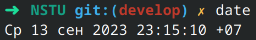

## Курс «Архитектура вычислительных системы»

### Лабораторная работа No 1

##### Тема: оценка характеристик персонального компьютера (ПК).

##### Задание. Написать bash-скрипт, который выводит на экран характеристики ПК в следующем формате:

## Содержание:

1. [Дата](#дата) \
2. [Имя учетной записи](#имя-учетной-записи) \
3. [Доменное имя ПК](#доменное-имя-пк) \
4. [Процессор](#процессор) \
   4.1. [Модель -](#модель) \
   4.2. [Архитектура -](#архитектура) \
   4.3. [Тактовая частота -](#тактовая-частота) \
   4.4. [Количество ядер -](#количество-ядер) \
   4.5. [Количество потоков на одно ядро -](#количество-потоков-на-одно-ядро) \ 
5. [Оперативная память](#оперативная-память) \
   5.1. [Всего -](#всего) \
   5.2. [Доступно -](#доступно) \
6. [Жесткий диск](#жесткий-диск) \
   6.1. [Всего -](#всего) \
   6.2. [Доступно -](#доступно) \
   6.3. [Смонтировано в корневую директорию / -](#смонтировано-в-корневую-директорию) \
   6.4. [SWAP всего -](#swap-всего) \
   6.5. [SWAP доступно -](#swap-доступно) \
7. [Сетевые интерфейсы](#сетевые-интерфейсы) \
   7.1. [Количество сетевых интерфейсов -](#количество-сетевых-интерфейсов) \

|  №   | Имя сетевого интерфейса | MAC адрес | IP адрес | Скорость соединения |
| :--: | ----------------------- | --------- | -------- | ------------------- |
|      |                         |           |          |                     |
|      |                         |           |          |                     |
|      |                         |           |          |                     |

## Дата

Для того, чтобы вывести текущую дату, 

нужно воспользоваться командой `date`

