## Курс «Архитектура вычислительных системы»

### Лабораторная работа No 1

##### Тема: оценка характеристик персонального компьютера (ПК).

##### Задание. Написать bash-скрипт, который выводит на экран характеристики ПК в следующем формате:

## Содержание:

1. [Дата](#дата)
2. [Имя учетной записи](#имя-учетной-записи)
3. [Доменное имя ПК](#доменное-имя-пк)
4. [Процессор](#процессор) \
   4.1. [Модель -](#модель) \
   4.2. [Архитектура -](#архитектура) \
   4.3. [Тактовая частота -](#тактовая-частота) \
   4.4. [Количество ядер -](#количество-ядер) \
   4.5. [Количество потоков на одно ядро -](#количество-потоков-на-одно-ядро)
5. [Оперативная память](#оперативная-память) \
   5.1. [Всего -](#всего) \
   5.2. [Доступно -](#доступно)
6. [Жесткий диск](#жесткий-диск) \
   6.1. [Всего -](#всегo) \
   6.2. [Доступно -](#дoступнo) \
   6.3. [Смонтировано в корневую директорию / -](#смонтировано-в-корневую-директорию-/) \
   6.4. [SWAP всего -](#swap-всего) \
   6.5. [SWAP доступно -](#swap-доступно)
7. [Сетевые интерфейсы](#сетевые-интерфейсы) \
   7.1. [Количество сетевых интерфейсов -](#количество-сетевых-интерфейсов)

|  №   | Имя сетевого интерфейса | MAC адрес | IP адрес | Скорость соединения |
| :--: | ----------------------- | --------- | -------- | ------------------- |
|      |                         |           |          |                     |
|      |                         |           |          |                     |
|      |                         |           |          |                     |

## Дата

Для того, чтобы вывести текущую дату,  нужно воспользоваться командой `$ date`

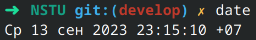

Можно воспользоваться параметрами форматирования, шаблон выглядит так: `$ date +"<строка форматирования>"`
Выведем просто текущую дату без времени и часового пояса - воспользуемся параметром `%D` 
Получим незамысловатую команду - `$ date +%D`, где %D - текущая дата в формате ММ/ДД/ГГ.

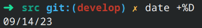

## Имя учетной записи

Команда `$ whoami` является составной частью слов «Who am I? (Кто я?)» и  печатает имя учетной записи, связанной с текущим действующим  идентификатором пользователя.

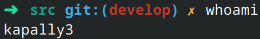

## Доменное имя ПК

Если мы запустим команду `$ hostname` без каких-либо параметров, отобразится текущее имя хоста и доменное имя нашей системы Linux, нашего ПК.

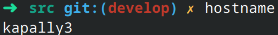

Команда `$ hostname` используется для просмотра имени компьютера и имени домена (DNS) (службы имен доменов).
**hostname** — это имя, которое присваивается  компьютеру, подключенному к сети, которое однозначно идентифицирует в  сети и, таким образом, позволяет получить доступ к нему без  использования его IP-адреса.

## Процессор

### Модель

Чтобы узнать модель процессора, достаточно выполнить следующую команду: `$ lscpu | grep -E '^Модель|^Model'`.

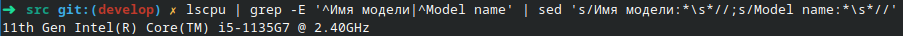

**lscpu**  собирает информацию об архитектуре процессора из sysfs и /proc/cpuinfo. 
**^** — сопоставляет символы в начале строки.
Опция **-E**  рассматривает шаблон как расширенное регулярное выражение.

Если же мы хотим узнать имя модели, то для этого нужно изменить шаблон в команде выше на `'^Имя модели|^Model name'`, чтобы получить такую команду: `$ lscpu | grep -E '^Имя модели|^Model name'`.

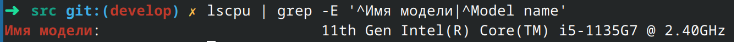

### Архитектура

Чтобы узнать архитектуру процессора, достаточно будет изменить шаблон команды из предыдущего пункта на `'^Архитектура|^Architecture'`, чтобы получилась такая строка: `$ lscpu | grep -E '^Архитектура|^Architecture'`.

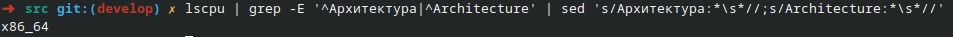

### Тактовая частота

В зависимости от системы, у пользователя могут быть разные выходные данные в этом пункте.

Команда с использованием `sudo` - права суперпользователя, которая используется в скрипте: `sudo  dmidecode -t processor | grep -E 'Current Speed'`.

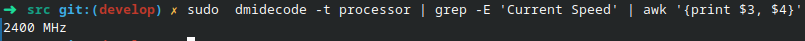

Для того, чтобы посмотреть максимальную и минимальные частоты, а также масштабирование частоты (на некоторых ОС этот пункт заменяется текущей частотой процессора), нужно ввести следующую команду: `lscpu | grep -E 'MHz'`.

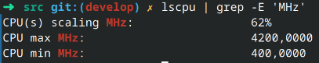

Если есть надобность посмотреть частоту всех ядер в процессоре, то вводим данную команду: `grep -E '^cpu MHz' /proc/cpuinfo`.

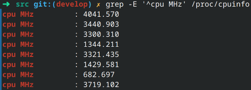

### Количество ядер

Чтобы узнать количество ядер, выполняем данную команду: `lscpu | grep -m 1 -w "^CPU(s):"`.

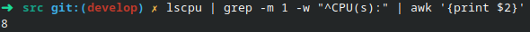

### Количество потоков на одно ядро

Количество поток на одно ядро находится благодаря следующей команды: `lscpu | grep -E '^Thread'`.

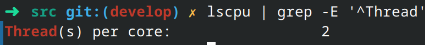

## Оперативная память

### Всего

Чтобы определить сколько всего оперативной памяти рабочая машина имеет, следует воспользоваться представленной командой: `grep -E '^MemTotal' /proc/meminfo`.

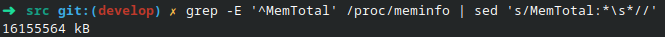

### Доступно

Для определения доступной оперативной памяти, заменяем шаблон `'^MemTotal'` на `'^MemAvailable'`, получаем такую команду: `grep -E '^MemAvailable' /proc/meminfo`.

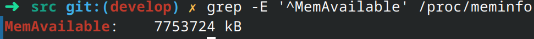

## Жесткий диск

### Всегo

Чтобы узнать сколько всего у нас места на диске, нужно воспользоваться командой с правами суперпользователя: `sudo fdisk -l | grep -m 1 -E '^Disk|^Диск'` 

`$ sudo fdisk -l | grep -m 1 -E '^Disk|^Диск'`

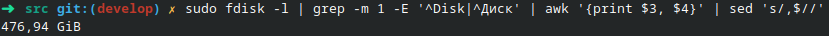

### Дoступнo	

### Смонтировано в корневую директорию /

`$ df -h /`

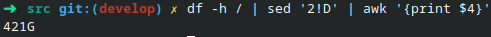
