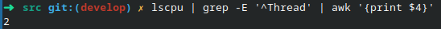
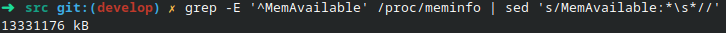
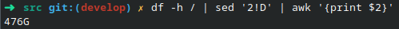
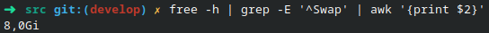
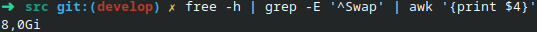

## Курс «Архитектура вычислительных системы»

### Лабораторная работа No 1

##### Тема: оценка характеристик персонального компьютера (ПК).

##### Задание. Написать bash-скрипт, который выводит на экран характеристики ПК в следующем формате:

## Содержание:

1. [Дата](#дата)
2. [Имя учетной записи](#имя-учетной-записи)
3. [Доменное имя ПК](#доменное-имя-пк)
4. [Процессор](#процессор) \
   4.1. [Модель -](#модель) \
   4.2. [Архитектура -](#архитектура) \
   4.3. [Тактовая частота -](#тактовая-частота) \
   4.4. [Количество ядер -](#количество-ядер) \
   4.5. [Количество потоков на одно ядро -](#количество-потоков-на-одно-ядро)
5. [Оперативная память](#оперативная-память) \
   5.1. [Всего -](#всего) \
   5.2. [Доступно -](#доступно)
6. [Жесткий диск](#жесткий-диск) \
   6.1. [Всего -](#всегo) \
   6.2. [Доступно -](#дoступнo) \
   6.3. [Смонтировано в корневую директорию / -](#смонтировано-в-корневую-директорию-/) \
   6.4. [SWAP всего -](#swap-всего) \
   6.5. [SWAP доступно -](#swap-доступно)
7. [Сетевые интерфейсы](#сетевые-интерфейсы) \
   7.1. [Количество сетевых интерфейсов -](#количество-сетевых-интерфейсов)

|  №   | Имя сетевого интерфейса | MAC адрес | IP адрес | Скорость соединения |
| :--: | ----------------------- | --------- | -------- | ------------------- |
|      |                         |           |          |                     |
|      |                         |           |          |                     |
|      |                         |           |          |                     |

## 

## Дата

Для того, чтобы вывести текущую дату,  нужно воспользоваться командой `$ date`

Можно воспользоваться параметрами форматирования, шаблон выглядит так: `$ date +"<строка форматирования>"`
Выведем просто текущую дату без времени и часового пояса - воспользуемся параметром `%D` 
Получим незамысловатую команду - `$ date +%D`, где %D - текущая дата в формате ММ/ДД/ГГ.

## Имя учетной записи

Команда `$ whoami` является составной частью слов «Who am I? (Кто я?)» и  печатает имя учетной записи, связанной с текущим действующим  идентификатором пользователя.

## Доменное имя ПК

Если мы запустим команду `$ hostname` без каких-либо параметров, отобразится текущее имя хоста и доменное имя нашей системы Linux, нашего ПК.

Команда `$ hostname` используется для просмотра имени компьютера и имени домена (DNS) (службы имен доменов).
**hostname** — это имя, которое присваивается  компьютеру, подключенному к сети, которое однозначно идентифицирует в  сети и, таким образом, позволяет получить доступ к нему без  использования его IP-адреса.

## Процессор

### Модель

Чтобы узнать модель процессора, достаточно выполнить следующую команду: `$ lscpu | grep -E '^Имя модели|^Model name' | sed 's/Имя модели:*\s*//;s/Model name:*\s*//'`.

**lscpu**  собирает информацию об архитектуре процессора из sysfs и /proc/cpuinfo. Утилита **grep** выполняет поиск *образца* в текстовых файлах и выдает все строки, содержащие этот образец. 
**^** — сопоставляет символы в начале строки.
Опция **-E**  рассматривает шаблон как расширенное регулярное выражение.
Редактор потоков **sed** – это неинтерактивный текстовый редактор,  выполняющий операции на данных, поступающих из стандартного ввода или из файла. Sed редактирует информацию построчно.

### Архитектура

Чтобы узнать архитектуру процессора, нужно ввести данную команду: `lscpu | grep -E '^Архитектура|^Architecture' | sed 's/Архитектура:*\s*//;s/Architecture:*\s*//'`

### Тактовая частота

В зависимости от системы, у пользователя могут быть разные выходные данные в этом пункте.

Команда с использованием `sudo` - права суперпользователя, которая используется в скрипте: `sudo  dmidecode -t processor | grep -E 'Current Speed' | awk '{print $3, $4}'`.

В Linux команда `awk` используется в командной строке для  обработки текста. Она позволяет выполнять действия над строками в  соответствии с заданным шаблоном.
В данном случае, мы выводим только 3 и 4 столбцы вывода.

Для того, чтобы посмотреть максимальную и минимальные частоты, а также масштабирование частоты (на некоторых ОС этот пункт заменяется текущей частотой процессора), нужно ввести следующую команду: `lscpu | grep -E 'MHz'`.

Если есть надобность посмотреть частоту всех ядер в процессоре, то вводим данную команду: `grep -E '^cpu MHz' /proc/cpuinfo`.

### Количество ядер

Чтобы узнать количество ядер, выполняем данную команду: `lscpu | grep -m 1 -w "^CPU(s):" | awk '{print $2}'`.

Команда выделяет первое вхождение CPU(s) и выводит второй столбец вывода.

### Количество потоков на одно ядро

Количество поток на одно ядро находится благодаря следующей команды: `lscpu | grep -E '^Thread' | awk '{print $4}'`.

## Оперативная память

### Всего

Чтобы определить сколько всего оперативной памяти рабочая машина имеет, следует воспользоваться представленной командой: `grep -E '^MemTotal' /proc/meminfo | sed 's/MemTotal:*\s*//'`.

### Доступно

Для определения доступной оперативной памяти, заменяем шаблон `'^MemTotal'` на `'^MemAvailable'`, получаем такую команду: `grep -E '^MemAvailable' /proc/meminfo | sed 's/MemAvailable:*\s*//'`.

## Жесткий диск

### Всегo

Чтобы узнать сколько всего у нас места на диске, нужно воспользоваться командой с правами суперпользователя:
`$ sudo fdisk -l | grep -m 1 -E '^Disk|^Диск' | awk '{print $3, $4}' | sed 's/,$//'`

### Дoступнo	

Для того, чтобы узнать сколько доступно места на жестком диске, стоит воспользоваться командой: `$ df -h / | sed '2!D' | awk '{print $4}'`

С помощью  `sed` выводим только вторую строку из вывода команды `$ df -h /`, а с помощью `awk` выводим только размер, т.е. 4 столбец.

### Смонтировано в корневую директорию /

Для просмотра сколько смонтировано в корневую директорию /, потребуется ввести данную команду: `$ df -h / | sed '2!D' | awk '{print $2}'`

Действия повторены из предыдущего пункта, но теперь выводим не четвертый столбец, а второй.

### SWAP всего

**SWAP (своп)** — это механизм виртуальной памяти, при  котором часть данных из оперативной памяти (ОЗУ) перемещается на  хранение на HDD (жёсткий диск), SSD (твёрдотельный накопитель). 

`free -h | grep -E '^Swap' | awk '{print $2}'`

### SWAP доступно

`free -h | grep -E '^Swap' | awk '{print $4}'`

## Сетевые интерфейсы

### Количество сетевых интерфейсов

`ls /sys/class/net | cat -n | tail -1 | awk '{print $1}'`

Таблица

`count=1
NUMBER="№"
printf "%-10s | %-46s | %-22s | %-20s | %-20s |\n" "$NUMBER" "Имя сетевого интерфейса" "MAC адрес" "IP адрес" "Скорость соединения"
for NAME in $(ls /sys/class/net/)
do
MAC=$(ifconfig $NAME | grep -E 'ether' | awk '{print $2}')
IP=$(ip --brief address show $NAME | awk '{print $3}' | cut -d'/' -f1)
if [  ${#MAC} == 0 ]; then
  MAC='                 '
fi
if [ ${#IP} != 0 ] && [ $NAME != "lo" ]; then
 SPEED=$(speedtest --secure | grep -E 'Download' | awk '{print $2, $3}')
else
 SPEED=' '
fi
printf "%-8s | %-25s | %-15s | %-15s | %-19s |\n" "$count" "$NAME" "$MAC" "$IP" "$SPEED"
count=$[count+1]
done`

